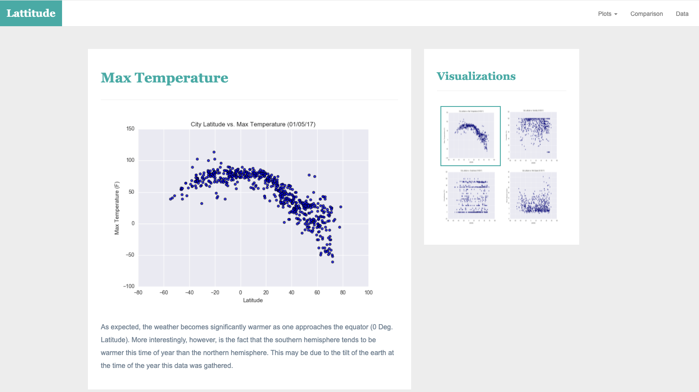

# Web Visualization Dashboard (Latitude)

## Latitude - Latitude Analysis Dashboard with Attitude

A visualization dashboard was created here using [weather data](Resources/cities.csv).

In building this dashboard, individual pages was created for each plot and a means by which it can be navigated between them. These pages contains the visualizations and their corresponding explanations. There is also a landing page, a page where a comparison of all of the plots can be seen, and another page where we can view the data used to build them.

### Website 

See the ["Screenshots" section](#screenshots) below.

The website consists of 7 pages total, including:

* A [landing page](#landing-page) containing:
  * An explanation of the project.
  * Links to each visualizations page. There is a sidebar containing preview images of each plot, and clicking an image take the user to that visualization.

* Four [visualization pages](#visualization-pages), each with:
  * A descriptive title and heading tag.
  * The plot/visualization itself for the selected comparison.
  * A paragraph describing the plot and its significance.

* A ["Comparisons" page](#comparisons-page) that:
  * Contains all of the visualizations on the same page so we can easily visually compare them.
  * Used a Bootstrap grid for the visualizations.
    * The grid is of two visualizations across on screens medium and larger, and 1 across on extra-small and small screens.

* A ["Data" page](#data-page) that:
  * Displays a responsive table containing the data used in the visualizations.
    * The table has a bootstrap table component. [Hint](https://getbootstrap.com/docs/4.3/content/tables/#responsive-tables)
    * The data came from exporting the `.csv` file as HTML, or converting it to HTML. See the Pandas documentation [here](https://pandas.pydata.org/pandas-docs/version/0.17.0/generated/pandas.DataFrame.to_html.html)

At the top of every page, there is a navigation menu that:

* Has the name of the site on the left of the nav which allows users to return to the landing page from any page.
* Contains a dropdown menu on the right of the navbar named "Plots" that provides a link to each individual visualization page.
* Provides two more text links on the right: "Comparisons," which links to the comparisons page, and "Data," which links to the data page.
* Is responsive (using media queries). 

### Screenshots
This section contains screenshots of each page that was built, at varying screen widths. 

#### Landing page

#### Comparisons page

#### Data page

#### Visualization pages

[Githubpage link](https://tamasree.github.io/web_design_challange/)

#### Contact Info
* [Linkedin Link](https://www.linkedin.com/in/tamasree-sinha/)
* email id : tamasree.g@gmail.com

